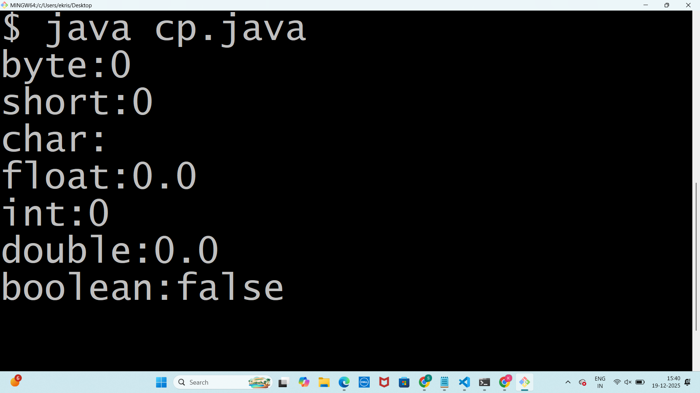

#Experiment1
## TITLE; 1a.)Display the primitive datatypes
```
class Datatypes{
static byte b;
static short s;
static char c;
static float f;
static int i;
static double d;
static boolean bool;
public static void main(String[] args){
System.out.println("byte:"+b);
System.out.println("short:"+s);
System.out.println("char:"+c);
System.out.println("float:"+f);
System.out.println("int:"+i);
System.out.println("double:"+d);
System.out.println("boolean:"+bool);
}
}
```
# OUTPUT

## TITLE; 1b.)Display the quadratic roots
```
import java.util.Scanner;
class QuadraticRoots {
public static void main(String[] args) {
double a,b,c,D;
Scanner sc= new Scanner(System.in);
System.out.print("Enter value of a:");
a=sc.nextDouble();
System.out.print("Enter value of b:");
b=sc.nextDouble();
System.out.println("Enter value of c:");
c=sc.nextDouble();
D=b*b-4*a*c;
System.out.println("Discriminant(D)="+D);
if (D>0) {
double x1=(-b+Math.sqrt(D))/(2*a);
double x2=(-b-Math.sqrt(D))/(2*a);
System.out.println("Roots are real and distinct.");
System.out.println("Root1="+x1);
System.out.println("Root2="+x2);
}else if (D==0) {
double x=-b/(2*a);
System.out.println("Roots are real and equal.");
System.out.println("Root="+x);
} else {
double real=-b/(2*a);
double imaginary=(Math.sqrt(-D)/(2*a));
System.out.println("Roots are imaginary(complex)");
System.out.println("Root1="+real+"+i"+imaginary);
System.out.println("Root2="+real+"-i"+imaginary);
}
}
}
```
#OUTPUT
![EXPERIMENT 1 OUTPUT]
(exp1b.png)
